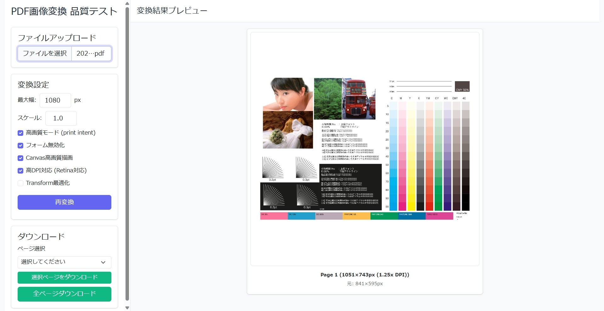

# pdfjs-to-image-quality-tester

pdfjs-distのPDF→画像変換品質を検証するための研究開発ツール

## 概要

このツールは、pdf.js (pdfjs-dist) によるPDFの画像変換時の品質を視覚的に確認・比較するためのシンプルなWebアプリケーションです。様々な変換パラメータをリアルタイムで調整し、変換結果を即座にプレビューできます。

## スクリーンショット



## 機能

### 変換設定パラメータ

- **最大幅**: 変換後の画像の最大幅を指定 (50-2000px、デフォルト: 1440px)
- **スケール**: PDFのレンダリングスケールを調整 (1-10、デフォルト: 1)
- **高画質モード (print intent)**: `intent: 'print'` を使用した高精細レンダリング
- **フォーム無効化**: インタラクティブフォームの描画を無効化
- **Canvas高画質描画**: `imageSmoothingQuality: 'high'` によるアンチエイリアシング向上
- **高DPI対応 (Retina対応)**: `devicePixelRatio` を利用した高解像度ディスプレイ対応
- **Transform最適化**: Canvas transformを使用した描画最適化

### 機能詳細

- PDFファイルのファイル選択によるアップロード
- 全ページの一括プレビュー表示
- 設定変更時の自動再レンダリング（500ms debounce）
- 各ページの変換サイズ情報表示（元サイズ / 変換後サイズ）
- 全ページ一括ダウンロード機能（PNG形式）
- 日本語フォント対応 (CMap使用)

## セットアップ

依存パッケージのインストール:

```bash
npm install
```

## 使い方

1. `index.html` をブラウザで開く
2. PDFファイルをアップロード
3. 左側のパネルで変換パラメータを調整（設定は自動的に反映されます）
4. 右側のプレビューエリアで変換品質を確認
5. 必要に応じて「ダウンロード」ボタンで全ページをPNG形式で保存

## 技術仕様

- **PDF.js バージョン**: 2.16.105 (CDN)
- **pdfjs-dist**: ^4.9.155 (npm)
- **CMap**: 日本語文字対応のため外部CMapを使用
- **レスポンシブデザイン**: モバイルにも対応

## 参考リンク

PDF.jsにおける日本語表示の問題解決方法:
https://zenn.dev/dynagon/articles/c00a3b5ac39103

## 作成者

**Takuya Motoshima**

* [github/takuya-motoshima](https://github.com/takuya-motoshima)
* [x/takuya_motech](https://x.com/takuya_motech)
* [facebook/takuya.motoshima.7](https://www.facebook.com/takuya.motoshima.7)

## ライセンス

[MIT](LICENSE)
